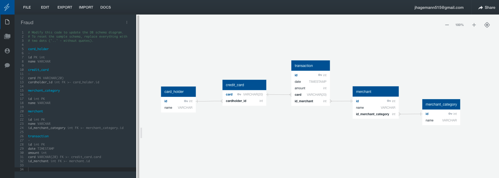

# Fraud Detection
## Searching for potentially fraudulent transactions using several tables tied to gether with foreign keys

This screenshot shows how I designed my database for this problem. The table relationships are as described:
  - 'one' card_holder --> 'many' cards 
  - 'one' card --> 'many' transactions
  - 'many' transactions --> 'one' merchant
  - 'many' nerchants --> 'one' merchant_category
  
  

