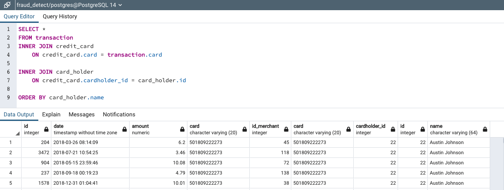
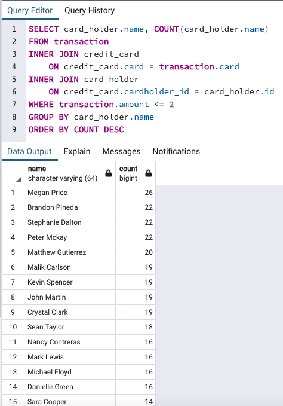

# Fraud Detection

*[Credit Card Fraudster by Richard Patterson](https://www.flickr.com/photos/136770128@N07/42252105582/) | [Creative Commons Licensed](https://creativecommons.org/licenses/by/2.0/)*

## Goal
Engineer data model using an Entity Relationship Diagram with Quickdbd. Then, use pgAdmin4 and PostgreSQL to query that database and discern indicators of credit card fraud.

## Objective

Analyze databse for fraudulent transactions using several tables tied to gether with foreign keys

## Table relationships
  - 'one' card_holder --> 'many' cards 
  - 'one' card --> 'many' transactions
  - 'many' transactions --> 'one' merchant
  - 'many' nerchants --> 'one' merchant_category
  

Screenshot of ERD: 

------------------------------------------------------------------------------------------------------

# Fraud Analysis

## Background

Some fraudsters may hack a credit card by making several small transactions, generally less than 2.00 USD, which are typically ignored by cardholders.

## How can we isolate the transactions of each cardholder?

This is my query to retrieve transactions grouped by cardholder:

## Count the transactions that are less than 2.00 USD per cardholder.

This is my query to count 'small transactions' per cardholder:

## Is there any evidence to suggest that a credit card has been hacked?

One person has 26 transactions under 2.00 USD. This leads all cardholders. The credit card company may wish to contact that individual to see if those specific transactions are legitimate. 

