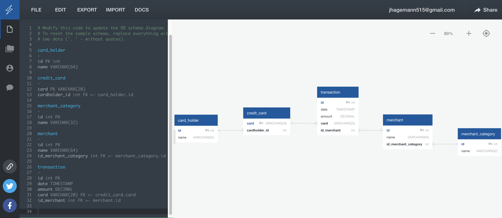

# Fraud Detection

*[Credit Card Fraudster by Richard Patterson](https://www.flickr.com/photos/136770128@N07/42252105582/) | [Creative Commons Licensed](https://creativecommons.org/licenses/by/2.0/)*

## Goal
Engineer data model using an Entity Relationship Diagram with Quickdbd. Then, use pgAdmin4 and PostgreSQL to query that database and discern indicators of credit card fraud.

## Objective

Analyze databse for fraudulent transactions using several tables tied to gether with foreign keys

## Table relationships
  - 'one' card_holder --> 'many' cards 
  - 'one' card --> 'many' transactions
  - 'many' transactions --> 'one' merchant
  - 'many' nerchants --> 'one' merchant_category
  

Screenshot of ERD: 

------------------------------------------------------------------------------------------------------

# Fraud Analysis

## Background

Some fraudsters may hack a credit card by making several small transactions, generally less than 2.00 USD, which are typically ignored by cardholders.

## How can we isolate the transactions of each cardholder?

This is my query to retrieve transactions grouped by cardholder:

## Count the transactions that are less than 2.00 USD per cardholder.

This is my query to count 'small transactions' per cardholder:

## Is there any evidence to suggest that a credit card has been hacked?

One person has 26 transactions under 2.00 USD. This leads all cardholders. The credit card company may wish to contact that individual to see if those specific transactions are legitimate. 

## What are the top 100 highest transactions made between 7:00 am and 9:00 am?

This is my query to filter and sort these transactions:

## Do you see any anomalous transactions that could be fraudulent?

The top 9 highest transactions during this time range from 100 USD to 1,894 USD. However, the rest of the 91 returned values are all well below this, from 11.65 USD to 23.13 USD. The top 9 highest are suspicious and potentially fraudulent being so much higher than the rest and making up only 10% of all the transactions during this time.  

## Is there a higher number of fraudulent transactions made during this time frame versus the rest of the day?

During the rest of the day (aka, hours not in between 7 and 9 am), only the top 100 transactions range from 22.78 USD to 2,249 USD, with the rest of the over 3000 transactions being well below this. Therefore, it does seem that unusually large and potentially fraudulent transactions occur in higher frequency/proportion to the rest during the 7am - 9am timeframe.  

## What are the top 5 merchants prone to being hacked using small transactions?

